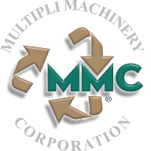

# Multipli Cylinder Paper Machine Study Software

------------------------------

## Why This Program Was Developed

All paper machine's production is governed by the rate of DRAINAGE hereafter referred to as "RATE OF FORMATION".  The data and knowledge base for this software is drawn from over 40 years of cylinder machine design and fabrication experience.  Along with this, of course, goes almost the same amount of time and intense scrutiny of both _**MULTIPLI's**_ and other manufactures' types of like equipment.  The intent is to assist in furthering this art form to the **pinnacle of potential** as related to the **RATE OF FORMATION**.

As we learned more and more about cylinder board manufacturing, we also learned more about the people attempting to manufacture under this process.  Due to the varied backgrounds, learning experiences, and types of equipment used, no common nomenclature nor general understanding exist unilaterally.  We feel that if some **common comparison system** were in place, a much better overall appreciation of this manufacturing process could be achieved.  Example: the best of these numbers are produced with a 42" dia. dry vat running at a 0.6% consistency with a 320 C.S.F. (Canadian Standard Freeness).

This program contains the most basic of formulas used in such an analysis system.  We have attempted to present this information in a simple and easy to use format, with as predictable results as possible.  We are always eager for any input that would either simplify, expand on, or improve this software and its application.

For more application details, refer to the online help: [https://github.com/dewhisna/MultipliMachineStudy/raw/master/doc/MachineStudy.pdf](https://github.com/dewhisna/MultipliMachineStudy/raw/master/doc/MachineStudy.pdf).

----------

## Installation

To install the application on Windows, simply download the latest installer from [https://github.com/dewhisna/MultipliMachineStudy/releases](https://github.com/dewhisna/MultipliMachineStudy/releases) or obtain it from [Multipli Machinery](http://multiplimachine.com/).  Copy the installer package to a convenient location on your computer, such as your desktop.  Right-click the installer package and select "Run as Admin" and follow the directions.

To run this application on other operating systems, or to extend or modify the Windows version, it will be necessary for you to compile it yourself from the source code provided on GitHub at [https://github.com/dewhisna/MultipliMachineStudy](https://github.com/dewhisna/MultipliMachineStudy).  To compile it from source, you will need to download the correct Qt package for your computer from [https://www.qt.io/](https://www.qt.io/) -- Qt 6.5.3 was used during the development.  You will need to install [CMake](https://cmake.org/) -- version 4.0.0 was used in creating this app.  And you will need a C++11 compliant compiler -- gcc 13.3.0 and MSVC 2022 were used during application development and are known to work.

To compile this application, simply launch Qt Creator, make sure you've configured CMake and the 6.5.3 Qt Kits, and then open the `src/MachineStudy/CMakeLists.txt` file as a project.  Wait for Creator and CMake to configure the project, and select build.

----------

## Disclaimer

_**MULTIPLI**_ neither assumes or implies any responsibility, monetarily or morally, for data generated by nor the application of any data generated or related to the application of this software.  Said software is offered, **free of charge**, to be used only as a tool or reference in the decision making process by others, for whatever purpose.  Furthermore, _**MULTIPLI**_ neither accepts nor implies any responsibility for the interface to or the compatibility with any other software or computer system or any problems resulting from either of the aforementioned.

This program is free software; you can redistribute it and/or modify it under the terms of the GNU General Public License as published by the Free Software Foundation; either version 3 of the License, or (at your option) any later version.

This program is distributed in the hope that it will be useful, but WITHOUT ANY WARRANTY; without even the implied warranty of MERCHANTABILITY or FITNESS FOR A PARTICULAR PURPOSE.  See the GNU General Public License for more details.

You should have received a copy of the GNU General Public License along with this program; if not, write to the Free Software Foundation, Inc., 675 Mass Ave, Cambridge, MA 02139, USA.
'Free' software refers to your free uninhibited ability to access and obtain this software in its exact original form, and your freedom to copy and share it with others, not necessarily that it was obtained 'for free', as reasonable fees may be charged to recover distribution costs.

Copyright © 2018-2025 Multipli Machinery Corp.

Contact: [http://multiplimachine.com/](http://multiplimachine.com/)

Written and developed for Multipli Machinery by Donald Whisnant

